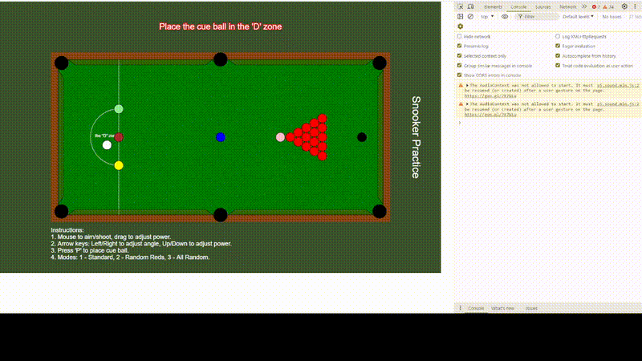
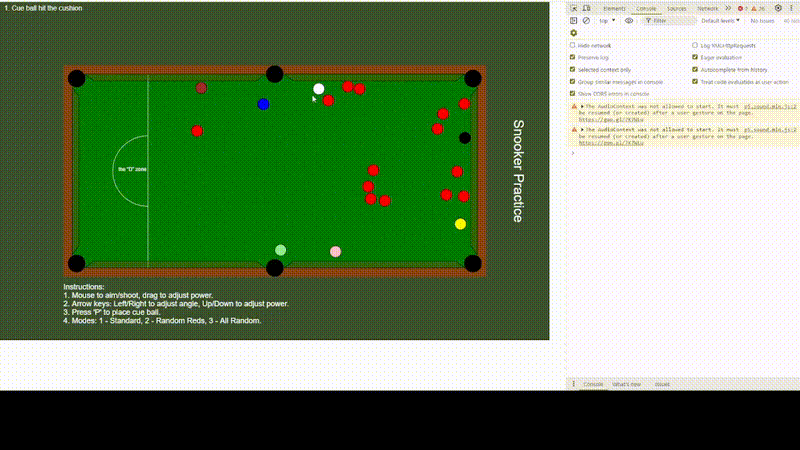

# Snooker Practice Application

## Project Title and Description

**Title:** Snooker Practice Application

This project simulates a virtual snooker table for practicing shots in three different modes. The purpose is to provide a realistic and interactive experience for users to improve their snooker skills by experimenting with different ball configurations and collision physics. Users can switch between Standard Mode, Random Red Ball Positioning, and Fully Random Positioning, allowing them to practice different scenarios and strategies.

## Tech Stack

- **JavaScript:** Main programming language used for the application's logic and interactivity.
- **Matter.js:** A 2D physics engine for realistic collision detection and ball movement.
- **HTML/CSS:** For structuring and styling the application interface.
- **p5.js:** For drawing and animating graphics on the canvas.

## Installation Instructions

1. **Use a modern web browser** like Chrome or Firefox.
2. **Run the application:**
   - Open the `index.html` file in your web browser to launch the application.

## Features and Functionality

### Three Play Modes:

- **Standard Mode:** Sets up the table with red balls in a triangle and colored balls in their designated spots.
- **Random Red Ball Positioning:** Places red balls randomly on the table for more challenging practice.
- **Fully Random Positioning:** Randomizes the positions of all balls, creating a unique setup each time.

### Additional Features:

- **Realistic Physics:** Utilizes the Matter.js physics engine to simulate realistic ball interactions and collisions.
- **Collision Detection:** Displays messages when the cue ball hits other balls or the cushion, enhancing user feedback.
- **Cue Ball Placement:** Allows users to place the cue ball manually within the 'D' zone for custom shot setups.
- **Foul Detection:** Detects and displays messages for fouls, such as potting two consecutive colored balls before all red balls are potted.

## Demos

### Gameplay Demo:
![the 3 modes as discussed in step 3 using 1,2,3 keystrokes](./assets/scenario1.gif

